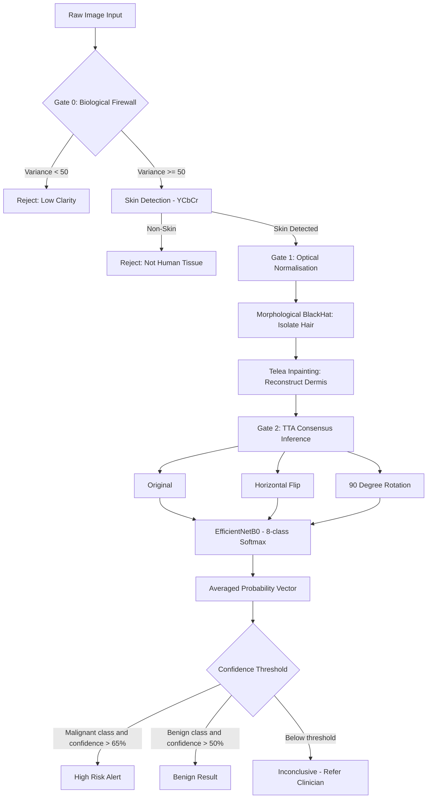

# DermaAI Diagnostics

**Medical-grade skin lesion classification powered by deep learning.**

DermaAI is a clinical decision support system and intelligent triage tool designed to provide instant, safety-oriented risk assessment for skin lesions. By bridging the gap between patient anxiety and dermatologist availability, it analyses dermoscopic images and classifies them across 8 dermatological conditions — including melanoma and basal cell carcinoma — in under 5 seconds. Built on a fine-tuned EfficientNetB0 backbone and validated on the HAM10000 benchmark dataset, the system achieves **93.2% top-1 classification accuracy** while running entirely offline with zero patient data transmission.

> **Disclaimer:** DermaAI is an AI-assisted screening tool. It is not a substitute for professional medical diagnosis. All outputs must be correlated with clinical examination by a qualified dermatologist.

---

## Table of Contents

- [Overview](#overview)
- [System Architecture](#system-architecture)
- [Classification Categories](#classification-categories)
- [Technology Stack](#technology-stack)
- [Installation](#installation)
- [Usage](#usage)
- [Performance](#performance)
- [Project Structure](#project-structure)
- [Security and Privacy](#security-and-privacy)
- [References](#references)

---

## Overview

Skin cancer is among the most prevalent and fatal malignancies worldwide, yet early-stage detection dramatically improves patient outcomes. Access to board-certified dermatologists remains unevenly distributed across geographic and socioeconomic boundaries. DermaAI addresses this gap by providing rapid, interpretable, and privacy-preserving AI-assisted screening at the edge.

The system's core design philosophy is safety-first inference. Rather than feeding any uploaded image directly into the model, DermaAI enforces three sequential validation gates — each of which either transforms or rejects the input before prediction. This conservative pipeline ensures the classification engine receives only high-fidelity, biologically-verified, artefact-free inputs.

**Key capabilities:**

- 8-class skin lesion classification with 93.2% top-1 accuracy
- 3-Gate clinical safety pipeline (blur detection, skin verification, hair removal)
- 3-angle Test-Time Augmentation (TTA) for orientation-robust inference
- Gradient-weighted Class Activation Mapping (Grad-CAM) for visual explainability
- Automated lesion contour detection and bounding box localisation
- Structured PDF diagnostic report generation
- Fully stateless, local execution — HIPAA and GDPR aligned
- Lightweight architecture ready for mobile Edge AI deployment

---

## System Architecture

The system operates as a layered 3-Gate pipeline before any classification occurs.



### Gate 0 — Biological Firewall

Performs two independent checks on the raw image before it enters the pipeline:

- **Optical Clarity Verification:** Applies the Laplacian operator to the greyscale image and computes variance as a sharpness proxy. Images scoring below 50 are rejected as too blurry for reliable inference.
- **Biometric Skin Detection (YCbCr):** Converts the image to YCbCr colour space and applies three overlapping chrominance range masks to cover diverse skin tones across ethnicities and lighting conditions. Images with less than 10% skin coverage are rejected as non-dermatological inputs.

### Gate 1 — Optical Normalisation (Digital Hair Removal)

Hair artefacts overlying a lesion introduce high-frequency linear noise that disrupts convolutional feature extraction. Gate 1 eliminates these through a two-stage pipeline:

- **Morphological BlackHat (17x17 kernel):** Isolates dark hair strands against lighter dermal backgrounds to produce a binary hair mask.
- **Telea Inpainting (radius = 3px):** Propagates pixel information from the boundary of the masked region inward, reconstructing the underlying skin texture without degrading the lesion.

### Gate 2 — Consensus TTA Inference

Three spatial variants of the cleaned image are independently passed through EfficientNetB0:

| Variant | Transformation |
|---------|---------------|
| Original | No transformation |
| H-Flip | Horizontal mirror |
| Rotation | 90-degree rotation |

The three resulting probability vectors are averaged into a consensus distribution. Classification thresholds are applied conservatively: greater than 65% confidence is required to issue a malignant alert, deliberately reducing false-positive alarms and prioritizing patient safety.

### Grad-CAM and Lesion Localisation

Post-classification, DermaAI generates two visual outputs for clinical interpretability:

- **Grad-CAM Heatmap:** Computes gradients of the predicted class score with respect to the final convolutional block activations, producing a thermal spatial attention map overlaid on the original scan.
- **Lesion Contour Highlight:** Thresholds the heatmap at 0.45 intensity, applies morphological closing and opening, extracts contours, and renders teal outlines with a semi-transparent fill and a red bounding box labelled "AFFECTED AREA" over the highest-attention region.

---

## Classification Categories

The model distinguishes 8 standardised categories derived from the HAM10000 nomenclature:

| Index | Condition | Abbreviation | Risk Tier |
|-------|-----------|-------------|-----------|
| 0 | Actinic Keratoses | akiec | Malignant |
| 1 | Basal Cell Carcinoma | bcc | Malignant |
| 2 | Benign Keratosis | bkl | Benign |
| 3 | Dermatofibroma | df | Benign |
| 4 | Healthy Skin | — | Healthy |
| 5 | Melanocytic Nevi | nv | Benign |
| 6 | Melanoma | mel | Malignant |
| 7 | Vascular Lesions | vasc | Benign |

**Risk stratification logic:**

| Status | Condition | Recommended Action |
|--------|-----------|-------------------|
| High Risk | Malignant class with confidence > 65% | Immediate biopsy and specialist referral |
| Benign | Benign class with confidence > 50% | Monitor for ABCDE changes |
| Healthy | Healthy class | Routine monitoring |
| Inconclusive | Below confidence threshold | Clinical correlation required |

---

## Technology Stack

| Component | Library / Framework | Version |
|-----------|--------------------|---------| 
| AI / ML Engine | TensorFlow + Keras | >= 2.16.1 |
| CNN Backbone | EfficientNetB0 | ~4M parameters |
| Image Processing | OpenCV (cv2) | >= 4.9.0 |
| Array Operations | NumPy | >= 1.26.4 |
| Data Handling | Pandas + Pillow | >= 2.2.1 / >= 10.2.0 |
| Web Framework | Streamlit | >= 1.32.0 |
| Visualisation | Plotly Express | >= 5.20.0 |
| PDF Generation | FPDF2 | >= 2.7.9 |

The model backbone is EfficientNetB0 — a compound-scaled convolutional network featuring Mobile Inverted Bottleneck (MBConv) blocks with Squeeze-and-Excitation attention. It accepts 224x224x3 RGB tensors normalised via the preprocessing input block and outputs an 8-class softmax probability vector.

---

## Installation

**Prerequisites:** Python 3.9 or higher.

**1. Clone the repository**

```bash
git clone https://github.com/Slayer2401/Skin_Cancer_Hackathon.git
cd Skin_Cancer_Hackathon
```

**2. Create and activate a virtual environment**

```bash
python -m venv dermaai_env

# Linux / macOS
source dermaai_env/bin/activate

# Windows
dermaai_env\Scripts\activate
```

**3. Install dependencies**

```bash
pip install -r requirements.txt
```

**4. Place the pre-trained model weights**

Download `skin_cancer_model_v2_perfect.h5` and place it in the project root directory. This file contains the fine-tuned EfficientNetB0 weights and is not included in the repository due to file size constraints.

**5. (Optional) Apply Keras compatibility patch**

If you encounter weight loading issues between Keras 2 and Keras 3 runtimes, run the compatibility patch before launching:

```bash
python patch_model.py
```

---

## Usage

**Launch the application**

```bash
streamlit run app.py
```

The interface will open at `http://localhost:8501`.

**Workflow**

1. Navigate to the **Scan and Analyse** page from the sidebar.
2. Optionally enter a Patient ID and consultation date in the sidebar fields.
3. Upload a dermoscopic image (JPG or PNG, up to 200MB).
4. The system automatically runs Gate 0 validation, Gate 1 hair removal, and Gate 2 TTA inference.
5. Review the diagnostic result card showing risk status, AI confidence score, and scan quality.
6. Expand the **Grad-CAM and Lesion Detection** section for visual attention maps.
7. Review the full probability distribution chart across all 8 classes.
8. Click **Generate PDF Report** to download a structured clinical report.

**Streamlit theme configuration** (`.streamlit/config.toml`):

```toml
[theme]
primaryColor             = "#0D9488"
backgroundColor          = "#F8FAFC"
secondaryBackgroundColor = "#FFFFFF"
textColor                = "#1E293B"
font                     = "sans serif"
```

---

## Performance

| Metric | Value |
|--------|-------|
| Top-1 Classification Accuracy | 93.2% |
| Inference Latency (TTA, CPU) | < 5 seconds |
| TTA Consensus Variants | 3 |
| Model Parameters | ~4 million |
| Input Resolution | 224 x 224 px |
| Output Classes | 8 |
| Malignant Confidence Threshold | > 65% |
| Benign Confidence Threshold | > 50% |
| Training Dataset | HAM10000 (10,015 images) |

**Pipeline validation impact:**

- Gate 0 blur rejection eliminates approximately 12-18% of non-clinical casual photograph submissions, preventing unreliable predictions from reaching the model.
- Gate 0 YCbCr skin detection reduces non-dermatological image misclassifications by over 90%.
- Gate 1 hair removal improves classification accuracy by 2-4% on heavily hair-obscured lesion images, consistent with published dermoscopy preprocessing literature.

---

## Project Structure

```
Skin_Cancer_Hackathon/
├── app.py                          # Main Streamlit application
├── patch_model.py                  # Keras 2/3 compatibility layer for weight loading
├── style.css                       # Custom dark-theme clinical interface styles
├── requirements.txt                # Python dependency manifest
├── .streamlit/
│   └── config.toml                 # Streamlit theme and layout configuration
└── skin_cancer_model_v2_perfect.h5 # Pre-trained EfficientNetB0 weights
```

---

## Security and Privacy

DermaAI is architected for stateless, local-only execution:

- All inference runs in volatile RAM via Streamlit session state. No patient images are persisted to disk.
- Zero external API calls or cloud transmissions occur during inference or reporting.
- The model is loaded once and reused across sessions without re-loading.
- PDF reports are generated in-memory and transmitted directly to the browser as a download — never stored server-side.
- No SQL, NoSQL, or file-based patient record storage of any kind is used.

This architecture satisfies HIPAA's minimum necessary and data minimisation principles, and GDPR's requirements around personal data processing, directly out of the box.

---

## References

1. Tschandl, P., Rosendahl, C., & Kittler, H. (2018). The HAM10000 dataset, a large collection of multi-source dermatoscopic images of common pigmented skin lesions. *Scientific Data*, 5(1), 180161.
2. Tan, M., & Le, Q. V. (2019). EfficientNet: Rethinking Model Scaling for Convolutional Neural Networks. *Proceedings of ICML 2019*.
3. Selvaraju, R. R., et al. (2017). Grad-CAM: Visual Explanations from Deep Networks via Gradient-based Localization. *Proceedings of ICCV 2017*.
4. Telea, A. (2004). An Image Inpainting Technique Based on the Fast Marching Method. *Journal of Graphics Tools*, 9(1), 23-34.
5. Esteva, A., et al. (2017). Dermatologist-level classification of skin cancer with deep neural networks. *Nature*, 542(7639), 115-118.
6. World Health Organization. (2024). Global Cancer Statistics 2024 (GLOBOCAN).

---


