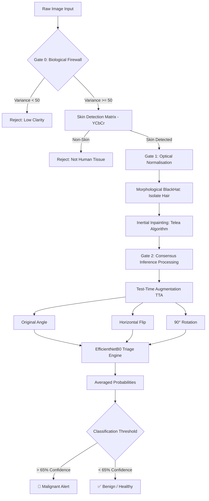

🔬 DermaAI: Intelligent Skin Lesion Diagnostics
DermaAI is a medical-grade computer vision application designed to provide instant, safety-oriented risk assessment for skin lesions using Deep Learning. It acts as an intelligent triage tool, bridging the gap between patient anxiety and dermatologist availability.

---
**Project Preview**

---
🚀 Key Features

Precision Classification: Distinguishes between 8 classes of lesions including Melanoma, Basal Cell Carcinoma, and Benign Nevi.

Multi-Stage Quality Gates: * Blur Detection: Uses Laplacian Variance to reject out-of-focus images.

Skin Detection: Employs YCbCr color space analysis to ensure the input is valid skin tissue.

Digital Hair Removal: Advanced image processing (Morphological BlackHat) to "shave" lesions digitally for clearer AI analysis.

3-Angle Consensus (TTA): Analyzes every image from multiple angles (original, flipped, rotated) to eliminate errors from lighting or camera orientation.

Safety-First Logic: Unlike standard models, DermaAI rejects low-confidence predictions instead of guessing, preventing false alarms.

---
🛠️ Tech Stack

Core AI: TensorFlow, Keras, EfficientNetB0 (Backbone) 

Computer Vision: OpenCV (Inpainting & Morphological Ops) 

Frontend: Streamlit (Custom Dark-Theme Medical Dashboard) 

Data: Trained on the HAM10000 clinical dataset.

---
📐 System Architecture
The system operates as a "3-Gate" safety pipeline:

Gate 0 (The Firewall): Rejects blurry or non-skin images.

Gate 1 (The Processor): Performs digital hair removal and image normalization.

Gate 2 (The Brain): EfficientNetB0 extracts features and classifies risk.

---
💻 Installation & Usage

1.Clone the repository:

git clone https://github.com/Slayer2401/Skin_Cancer_Hackathon.git
cd Skin_Cancer_Hackathon

2.Install dependencies:

pip install -r requirements.txt

3.Run the application:

streamlit run app.py

---
📊 Performance & Evaluation

Model: EfficientNetB0 (Transfer Learning) 

Logic: High-confidence thresholding (>65%) for malignant alerts to prioritize patient safety.

Scalability: Lightweight architecture (4M parameters) ready for mobile Edge AI deployment.

---
📄 References

Dataset: HAM10000 (Tschandl et al., 2018).

Backbone: EfficientNet (Tan & Le, 2019).

Context: Global Cancer Statistics 2024 (GLOBOCAN).

---
Created by Team CodeNova for the APEX AI Hackathon 2026.
